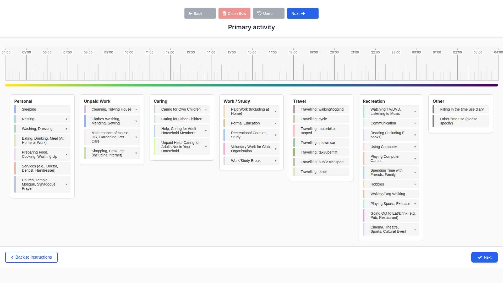
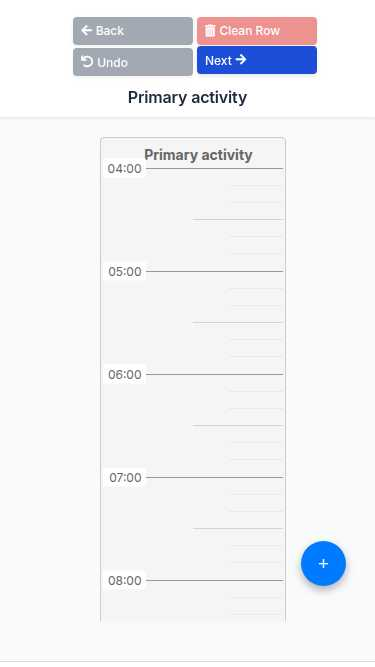

# Responsive Layouts

Mobile and Desktop Interface Design

[← Back to Documentation](index.md)

## Overview

O-ELIDDI features fully responsive layouts that adapt to different screen sizes and device types. The application automatically detects the user's device and optimizes the interface for the best user experience.

### Key Responsive Features

- Mobile-first responsive design
- Touch-friendly interface elements
- Adaptive timeline layout
- Optimized button placement and sizing
- Device-specific interaction patterns

## Desktop Layout

The desktop version provides a comprehensive interface designed for precise mouse interactions and detailed data entry sessions.

### Desktop Features

- ✓ Full-width timeline display
- ✓ Horizontal navigation controls
- ✓ Precise mouse-based drag and drop
- ✓ Larger clickable areas for detailed selection
- ✓ Optimized for keyboard navigation
- ✓ Multi-column button layout

## Mobile Layout

The mobile version features a compact, touch-friendly interface optimized for smartphone usage and on-the-go data collection.

### Mobile Features

- ✓ Compact vertical layout
- ✓ Touch-friendly controls
- ✓ Finger-optimized drag and drop
- ✓ Thumb-accessible navigation
- ✓ Simplified button arrangement
- ✓ Mobile-specific gestures support

## Layout Comparison

### Desktop (1024px+)

- ✓ Horizontal timeline orientation
- ✓ Multi-column control layout
- ✓ Hover effects enabled
- ✓ Keyboard shortcuts available
- ✓ Detailed tooltips

### Mobile (< 768px)

- ✓ Vertical timeline orientation
- ✓ Single-column control layout
- ✓ Touch gestures optimized
- ✓ Simplified interaction model
- ✓ Mobile-friendly spacing

## Responsive Breakpoints

The application uses the following breakpoints to determine the optimal layout:

| Device Type | Screen Width | Layout | Features |
|---|---|---|---|
| Desktop | 1024px and above | Full Desktop | All features, multi-column layout |
| Tablet | 768px - 1023px | Hybrid | Touch-optimized with desktop features |
| Mobile | Below 768px | Mobile | Compact layout, touch-first design |

## Technical Implementation

The responsive design is implemented using:

- **CSS Media Queries:** Responsive breakpoints and layout adjustments
- **Flexbox and Grid:** Modern layout systems for adaptive containers
- **JavaScript Detection:** `getIsMobile()` function for device-specific behavior
- **Touch Events:** Native touch event handling for mobile interactions
- **Viewport Meta Tag:** Proper mobile viewport configuration

### Key CSS Classes

- `.mobile-only` - Elements visible only on mobile
- `.desktop-only` - Elements visible only on desktop
- `.touch-friendly` - Touch-optimized interactive elements
- `.responsive-layout` - Adaptive container layouts

## Usage Recommendations

### For Researchers

- Use desktop layout for detailed study setup and data analysis
- Test both layouts during pilot studies
- Consider participant device preferences when deploying

### For Participants

- Mobile layout is ideal for quick, on-the-go data entry
- Desktop layout provides more detailed view for comprehensive logging
- Both layouts support the same functionality

---

*O-ELIDDI Responsive Layouts Documentation - Designed for optimal user experience across all devices*